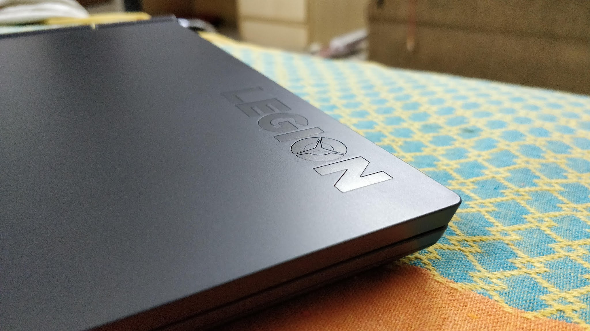

&nbsp;Changed my laptop recently. Got the beautiful Lenovo Legion 5 AMD Ryzen 7 4800h with 1660ti. It's a beast no
    matter what you throw at it.&nbsp;

My primary purpose was not gaming but to run extensive simulations on it and use it as a short rig for network
    training as well (I have been going away on Battlefield 5 though. Occassionally :) ). Most of my work is centered
    around research an open source, so I love using Linux and the freedom it offers. But unfortunately it does come with
    a cost. The cost of poor user experience. While I understand that linux wasnt made for this purpose, recent efforts
    having been inching slowly to the possibility for the same.&nbsp;

I was comfortable with Ubuntu on my earlier laptop so I went= ahead with the same this time around. The thought of
    documenting stuff came instantly but has been on the hold for long. This post is an archive for the solutions that I
    found and can look up later.

Hardware:

Processor: AMD Ryzen 7 4800h GFX: NVidia GTX 1660ti Wifi card: 

Software

Distro: Ubuntu 20.04 Kernel : 5.8

<b>Boot:</b>

I could not get it to boot straight away from the live disk. This was easy to look upto and debug as I had faced this
    before.

Symptoms: Black screen, no control, purple dashed line, some ACPI errors

Cause: Highly likely due to unsupported graphics

Solution: While in grub, press "E" at the try ubuntu option to enter custom boot parameters screen. Add "nomodeset"
    to the end o<code>f</code> <code></code>

<code>GRUB_CMDLINE_LINUX_DEFAULT="quiet splash" </code>

 This will make the kernel boot without any drivers for the video card. After booting up you can go ahead and
    install the distro. Keep in mind that these parameters will not persist across the installation. After installing
    repeat the same thing to boot again. After complete installation you can install the Nvidia proprietary drivers from
    the main ppa.&nbsp;

<b>Graphics:</b>

I have got the 450 driver version running for Nvidia as of now. Things that are working:

&nbsp;&nbsp; &nbsp;1. External monitors +HDMI audio works perfectly

&nbsp;&nbsp; &nbsp;2. Graphics themselves, driver itself

Things that are not working:

&nbsp;&nbsp; &nbsp;1. Hybrid mode with Renoir graphics
Dont forget to turn the dedicated graphics
only option from the BIOS settings of the laptop. I wasted a lot of time because of this. The driver would not load even
after I had installed it. Instead, the nvdia-settings options showed nothing and the card wasnt recognised. The command
line threw the following error:
WARNING: Unable to locate/open X configuration file.

After some searching I found a very <a
        href="https://forums.developer.nvidia.com/t/nvidia-xconfig-doesnt-do-what-i-want-it-to-nor-does-nvidia-settings/107883"
        target="_blank">good link </a>that has the entire discussion on amd/nvidia hybrid mode. The discussion stated in
    conclusion that you can either get the external
    monitor working or the hybrid mode working. Since i have to use the
    monitor I traded off. This will probably be fixed in future updates so I
    can wait.&nbsp;

The only draw back( and its a big one) is the battery life. I suspect
    nvdia eats it all up. I get a max&nbsp; of 2-2.5 hours of average pycharm,
    firefox, libre office use out of the laptop.&nbsp; There is <a
        href="https://www.reddit.com/r/linux_gaming/comments/f79trt/how_to_setup_a_ryzen_laptop_with_an_nvidia_gpu/."
        target="_blank">this solution</a> however if you want this fast. 

At the end the bios solution worked for me.  

Things I havent tested:

&nbsp;&nbsp; &nbsp;1. CUDA performace.&nbsp;

&nbsp;<b>Brightness:</b>

This also did not work out of the box and I had to scourge the internet a lot for this. The acpibacklight=vendor<b>
    </b>solution did not work for me. The following link finally worked which just added some config into the
    10-nvidia.conf file. Note: you will have to configure graphics before doing this as the relevant config file will be
    made.  

https://www.debugpoint.com/2016/10/2-ways-fix-laptop-brightness-problem-ubuntu-linux/

<b>Audio</b>

Ugh. This is a huge pain the ass. I thought such a basic functionality which has been developed from earlier kernels
    will transfer perfectly to new distros and kernels.<b> </b>I guess it is again because of the unusual cpu/gpu combo
    but its unnerving nonetheless.

There are two main problems:

1. The speaker is not loud enough to begin with. I mean it is in hardware&nbsp; sense&nbsp; but only on windows. I
    performs poorly on linux for some reason. I end up using the boost most of the time but that isnt really a solution.
    Moreover, there is this weird issue which casues the speakers to go deaf when the laptop resumes from sleep. The
    sound settings show "Dummy output" and there is no sound.

Solution: A potential workaround that i found was to do "pulseadio -k" to kill the and reload the driver. This makes
    it fine&nbsp;

2. The microphone. THE MICROPHONE. Unlucky for me, I found this error in a meeting with my project supervisor. The
    microphone doesnt register anything and the red bar in settings does not move. The device name is" Digital
    Microphone*Family 17h*Audiocontroller*.&nbsp;

Solution: The first comment at <a
        href="https://www.linuxuprising.com/2018/06/fix-no-sound-dummy-output-issue-in.html" target="_blank">this
        site<i> </i></a>worked wonders for me. For the sake of posterity,&nbsp; I'll mention it here. Just add "options
    snd-hda-intel index=1" to the end of /etc/modprobe.d/alsa-base.conf 

And it worked! Untiiillll it didnt. After another sleep cycle it regressed. Will have to look into this further. I
    suspect the nvidia card again. *Curse*

&nbsp;

I'll add more stuff here as I go on debugging.&nbsp;  

Update 26-01-21 The mic problem can be resolved sometimes by restarting the alsa-base and then restarting
    pulseudio. For some reason, this order is necessary or it wont work. This process of restarting alsa on the other
    hand causes sleep/resume issues. So, its a tradeoff for now 

 

 

 

 

 
